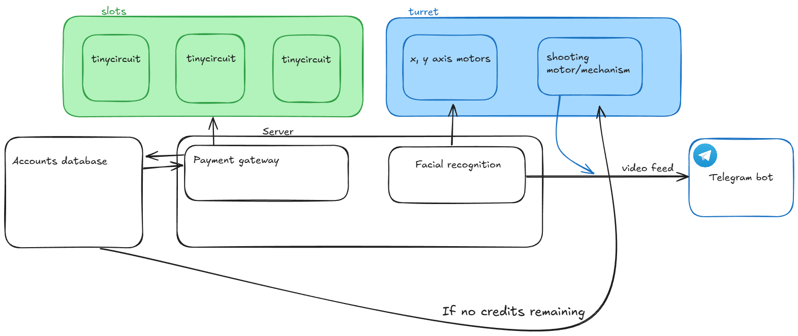
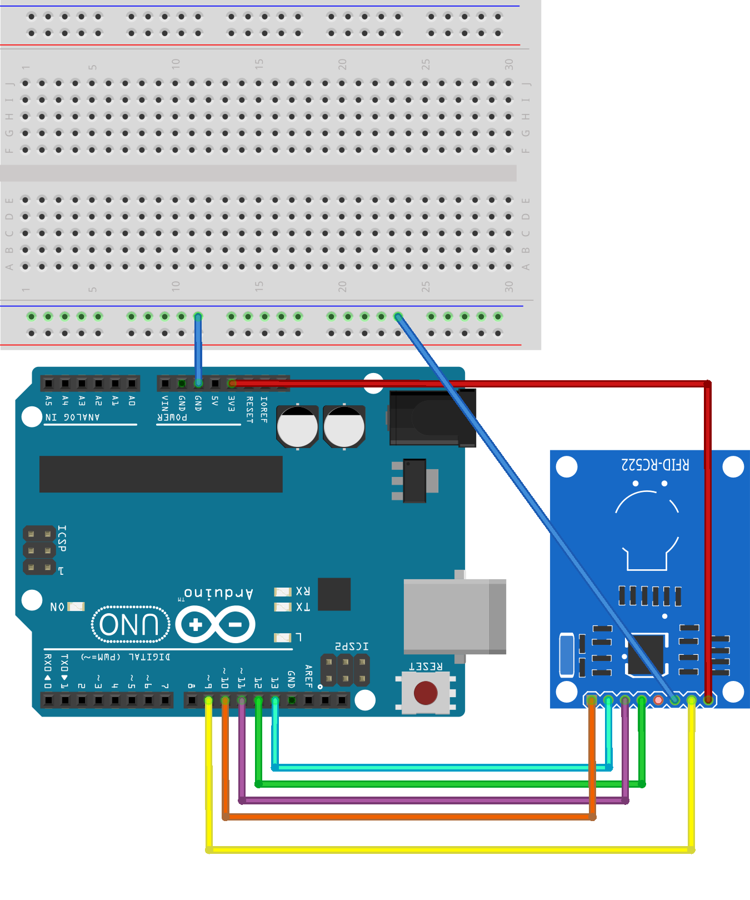
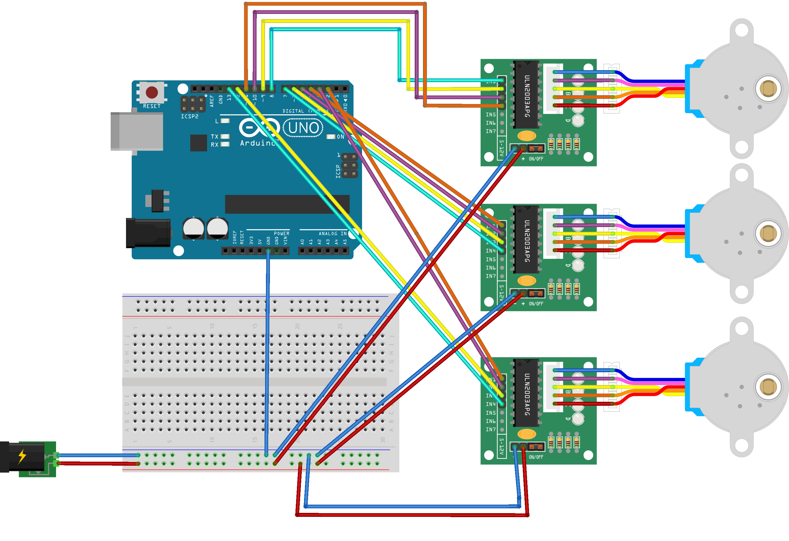
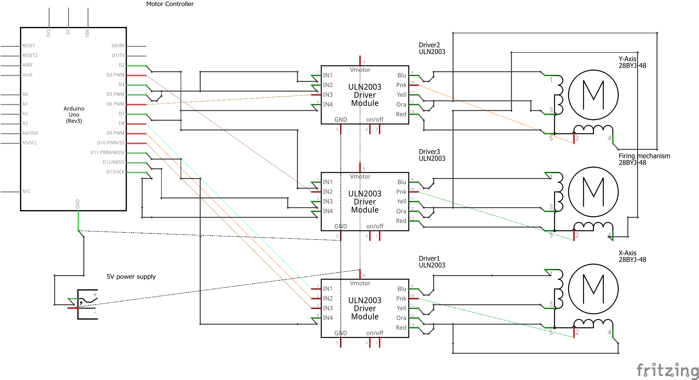

# Slot Machine Gun
This project serves as an allegory for the inherent risks of gambling, emphasizing how effortlessly individuals can descend a slippery slope of chance and compulsion through the personification and of these hazards in this playful, gamified form, combining a slot machine with a foam dart launcher and a face tracking gimbal.




## What's in the repo
- `slots/` - TinyScreen+ slot firmware (`jackpot_extra3x1.ino`) and MFRC522 RFID scan sketch (`rfid_scanner.ino`).
- `payment/gateway/` - Python bridge for RFID -> credit server and socket messaging to slots/turret.
- `payment/gateway/jackpot.py` - Slot "casino" server that drives the three slot displays and computes payouts.
- `payment/server/` - SQLite schema, forms, and stubs for the credit service that owns balances (plus Android NFC top-up client in `AppInterface/`).
- `turret/src/` - Arduino Uno firmware for three ULN2003/28BYJ-48 steppers (pan/tilt/fire) with a serial command set.
- `turret/host/` - Python tooling: serial CLI + OpenCV face tracking (`stepper_cli.py`) and Telegram clip sender (`killcambot.py`).
- `schematics/` and `images/` - Mechanical/electrical references, turret photos, and wiring diagrams.

## System design
- **Slots subsystem** - Three TinyScreen+ displays (clients 2, 3, 4) each with a WiFi TinyShield. They spin symbols and report results back to the jackpot server; they also render credit depletion and payout notices.
- **Payment gateway** - An MFRC522 RFID reader + Arduino serial output. A Python bridge charges spins against a credit service and forwards results to the jackpot server; it also notifies the turret when credits hit zero.
- **Credit service** - SQLite-backed HTTP API (expected to be served via `uvicorn main:app`). Holds RFID -> credit balances, admin UI, and Android NFC top-up app.
- **Turret** - Two-axis gear-driven rig plus a firing servo, controlled by Arduino firmware over serial. A host Python CLI performs face tracking and reacts to "NO CREDS" events via TCP.

### Key images
- Slots + payment wiring: 
- Turret wiring: 
- Turret wiring schema: 

## Parts lists
**Turret**

Components  
| Label | Part Type | mn | mpn | part number |
| --- | --- | --- | --- | --- |
| 5V power supply | Power plug |  |  |  |
| Driver1 | 28BYJ-48 Driver Module |  |  | ULN2003 |
| Driver2 | 28BYJ-48 Driver Module |  |  | ULN2003 |
| Driver3 | 28BYJ-48 Driver Module |  |  | ULN2003 |
| Firing mechanism | 28BYJ-48 Stepper Motor |  |  | 28BYJ-48 |
| Motor Controller | Arduino Uno (Rev3) |  |  |  |
| X-Axis | 28BYJ-48 Stepper Motor |  |  | 28BYJ-48 |
| Y-Axis | 28BYJ-48 Stepper Motor |  |  | 28BYJ-48 |

Quantities  
| Amount | Part Type | mn | mpn | part number |
| --- | --- | --- | --- | --- |
| 3 | 28BYJ-48 Driver Module |  |  | ULN2003 |
| 3 | 28BYJ-48 Stepper Motor |  |  | 28BYJ-48 |
| 1 | Arduino Uno (Rev3) |  |  |  |
| 1 | Power plug |  |  |  |

**Payment gateway**

Components  
| Label | Part Type | mn | mpn | part number |
| --- | --- | --- | --- | --- |
| Part1 | Arduino Uno (Rev3) |  |  |  |
| Part3 | RFID-RC522-v2 |  |  |  |

Quantities  
| Amount | Part Type | mn | mpn | part number |
| --- | --- | --- | --- | --- |
| 1 | Arduino Uno (Rev3) |  |  |  |
| 1 | RFID-RC522-v2 |  |  |  |

## Slots firmware (`slots/jackpot_extra3x1.ino`)
- Targets Arduino TinyScreen+ with WiFi TinyShield; draws three clipped symbol rows and performs weighted spins (`symbolOdds`).
- Networking: set `ssid`, `pass`, `serverIP`, and `port` (default `10.102.150.117:5000`). Each client sets a unique `devNum` (2, 3, or 4) and static IP (`localIp`).
- Protocol:
  - Client connects and sends `[0xFD, devNum]`. Server replies `0xFE` handshake; client answers `0xFF`.
  - A single byte `0-5` commands the middle symbol target; client streams 4 bytes back `[devNum, top, mid, bottom]`.
  - `0xAA` -> display "No Credits Left"; `0xAB` + payout byte -> show "You win N credits!".
  - High-bit masks (`0x80 | bits`) flash winning rows.
- Build/upload: use Arduino IDE with TinyScreen/WiFi101 libs, or PlatformIO if you port the board definition. Flash three devices with distinct `devNum`.

## RFID scan sketch (`slots/rfid_scanner.ino`)
- MFRC522 wired to SS=D10, RST=D9; streams detected UID over serial to the Python gateway.
- Blocks further scans until it receives `DONE` (or `BAL:<float>`) over serial from the gateway.

## Jackpot server (`payment/gateway/jackpot.py`)
- Listens on `0.0.0.0:5000` for slot clients.
- Maintains credits, issues spin targets, collects results, computes payouts (`MULTIPLIERS`), and triggers row flashes.
- Commands:
  - Enter to roll random (deducts `BET`), `t N` to force all reels to symbol `N`.
  - `c` add 100 credits, `s` show credits, `set N` override balance, `q` quit.
- Also hosts a localhost-only channel for the RFID gateway: receives `"SUCCESS"` to roll and return a payout to the gateway, or `"NO CREDS"` to send `0xAA` to slots.

Run:
```bash
python payment/gateway/jackpot.py
```

## Payment gateway bridge (`payment/gateway/deduct_credits_to_spin.py`)
- Dependencies: `requests`, `pyserial`.
- Serial: listens to RFID UID lines from the Arduino on `SERIAL_PORT`/`BAUD_RATE`.
- HTTP: posts to credit API (`BASE_URL` deduct, `BASE_URL_2` add payout).
- Sockets:
  - Connects to jackpot server at `HOST:PORT` (default `127.0.0.1:5000`) to send `"SUCCESS"`/`"NO CREDS"` and read payout bytes.
  - Connects to turret listener at `HOST2:PORT2` (default `10.102.150.134:9000`) to forward `"NO CREDS"` so the turret can react.
- Serial flow: after each scan it sends `DONE` back to the Arduino to re-arm scanning.
- Update the hard-coded IPs/ports and amounts before running.

Run:
```bash
python payment/gateway/deduct_credits_to_spin.py
```

## Credit service (`payment/server`)
- SQLite schema in `database.py` with `users`, `rfid_cards`, and `customers`; DB file `shop.db`.
- Pydantic models in `models.py`; `.env` holds `DEDUCTION_AMOUNT`.
- Templates: login/register flows and `dashboard.html` for admin credit adjustments and customer listing.
- QA helper: `qa_test.py` posts a sample RFID deduct request to `http://127.0.0.1:8000/rfid/deduct`.
- Intended to run with `uvicorn main:app --reload --host <ip>` (see `start.txt`). Ensure `main.py` exposes a FastAPI/Starlette `app` and routes for:
  - `POST /rfid/deduct` and `POST /rfid/add` (used by the gateway bridge),
  - `POST /admin/add` (used by the Android NFC client),
  - auth + dashboard routes rendered from `templates/`.

> Note: the current `main.py` is a stub; wire up the FastAPI/Flask app to match the expected endpoints above.

## Android NFC top-up (`payment/server/AppInterface`)
- Simple NFC Activity (`MainActivity.kt`) reads a tag, displays the UID, and POSTs to `http://103.213.247.25:8000/admin/add` with `rfid_id` + `amount`.
- Built with Gradle/Kotlin (see `build.gradle.kts`); UI layout in `app/src/main/res/layout/activity_main.xml`.

## Turret firmware (`turret/src/main.cpp`)
- PlatformIO project for Arduino Uno driving three ULN2003/28BYJ-48 steppers (A: D8-D11, B: D4-D7, C: D2/D3/D12/D13) with direction inversion flags.
- Serial command set (115200 baud): `HELP`, `SPEED <rpm>`, `A|B|C <steps>`, `AB <a> <b>`, `ABC <a> <b> <c>`, `TARGET`, `STOP/RESUME`, `RELEASE`, `DEMO ON|OFF`.
- `TARGET` macro sweeps motor C; `DEMO` oscillates all axes for burn-in.
- Build/upload with PlatformIO:
```bash
cd turret
pio run -t upload
pio device monitor -b 115200
```

## Turret host tools (`turret/host`)
- `stepper_cli.py` - Serial client plus extras. With no arguments it now auto-runs face tracking + listener with: `track --port COM5 --cam 0 --cam-api dshow --rpm 12 --step-scale 0.05 --max-step 50 --listen-while-track --tcp-host 0.0.0.0 --tcp-port 9000`.
  - Basic commands: `python stepper_cli.py speed 15 --port COM5`.
  - Face tracking (custom): `python stepper_cli.py track --port COM5 --cam 0 --cam-api dshow --rpm 12 --step-scale 0.05 --max-step 50`.
  - TCP listener: `python stepper_cli.py listen --tcp-port 9000` to react to `"NO CREDS"` from the payment gateway (fires motor C sweep and optional camera clip).
  - Combined tracking + listener (custom ports/backends): `python stepper_cli.py track --listen-while-track --tcp-host 0.0.0.0 --tcp-port 9000`.
- `killcambot.py` - Utility to send recorded clips to Telegram subscribers; requires `python-telegram-bot` and a valid bot token/chat IDs.

## Suggested bring-up order
1. **Credit service** - Ensure `/rfid/deduct`, `/rfid/add`, and `/admin/add` endpoints work against `shop.db`.
2. **Jackpot server** - Start `payment/gateway/jackpot.py` and seed credits via the console (`c` or `set N`).
3. **Turret listener** - Run `stepper_cli.py listen --tcp-port 9000` (or `track --listen-while-track`).
4. **Gateway bridge** - Start `deduct_credits_to_spin.py` with correct serial port and API IPs.
5. **RFID scanner** - Flash `slots/rfid_scanner.ino` to the reader Arduino.
6. **Slot displays** - Flash `slots/jackpot_extra3x1.ino` to three TinyScreen+ units with `devNum` 2/3/4 and confirm they reach the server.

## Security & safety notes
- Secrets are currently in-source (WiFi SSID/password, Telegram bot token, service IPs). Rotate these for any real deployment.
- The build involves moving hardware (turret servos/steppers) and projectile firing-keep clearances, test without darts first, and add hard stops or current limits as needed.
- Gambling theme is illustrative only; do not deploy in environments with minors or where gambling content is restricted.

## Troubleshooting
- Slots not connecting: verify WiFi credentials, static IPs, and that `serverIP`/port are reachable; confirm the `0xFE/0xFF` handshake completes.
- No payouts: check jackpot console logs for missing device reports or insufficient credits; ensure `LINES` covers the row you expect.
- Gateway timeouts: confirm the credit API is reachable; inspect `BASE_URL`/`BASE_URL_2` and network paths.
- Turret not moving: check COM port, 5V supply to ULN2003 boards, and use `stepper_cli.py help` or `repl` to issue manual steps.
